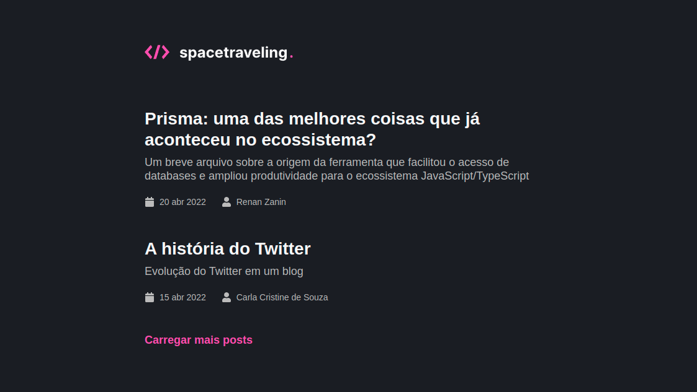
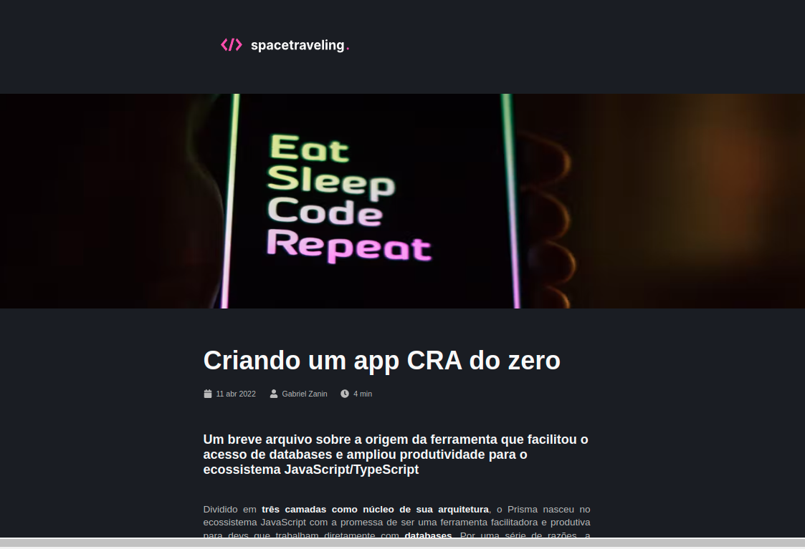

<p align="center">
   
</p>

<p align="center">
   <a href="https://www.linkedin.com/in/gabriel-zanin-ab802a206//">
      
   </a>
  
  
  
  
  <a href="mailto:gabriel.zaninde@gmail.com">
   
  </a>
</p>

<p align="center">
  📮 read your favorite posts while you code in react .
</p>


# 📌 Contents

- [📌 Contents](#-contents)
- [:camera: Screenshots](#camera-screenshots)
- [:rocket: Technologies](#rocket-technologies)
- [:computer: How to run](#computer-how-to-run)
- [:bug: Issues](#bug-issues)
- [:sparkles: Contributing](#sparkles-contributing)
- [:page_facing_up: License](#page_facing_up-license)

# :camera: Screenshots
<div align="center">
   
   
</div>

 <!-- # :camera: Gif
<div align="center">
   
</div> -->

# :rocket: Technologies
This project was made using the follow technologies:

* [Typescript](https://www.typescriptlang.org/)
* [React](https://reactjs.org/)
* [Prismic CMS](https://prismic.io/)
* [NextJS](https://nextjs.org/)

# :computer: How to run

```bash
# Clone Repository
$ git clone https://github.com/ZaninDe/blog-nextjs.git
```

```bash
# Install Dependencies
$ yarn

# Run Aplication
$ yarn dev
```
Go to http://localhost:3000/ to see the result.

# :bug: Issues

Create a <a href="https://github.com/ZaninDe/blog-nextjs/issues">new issue report</a>, it will be an honor to be able to help you solve and further improve our application.

# :sparkles: Contributing

- Fork this repository;
- Create a branch with your feature: `git checkout -b my-feature`;
- Commit your changes: `git commit -m 'feat: My new feature'`;
- Push to your branch: `git push origin my-feature`.

# :page_facing_up: License

This project is under the [MIT license](./LICENSE).
Made with 💖 by [Gabriel Zanin](https://www.linkedin.com/in/gabriel-zanin-ab802a206//).

Thank you! 🌠
